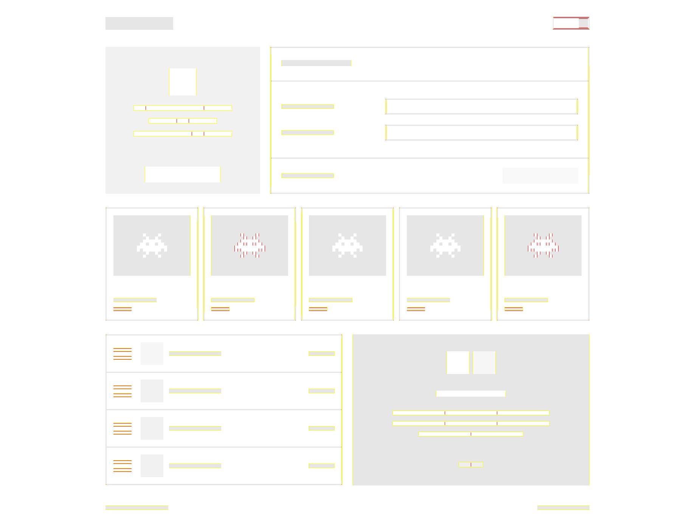
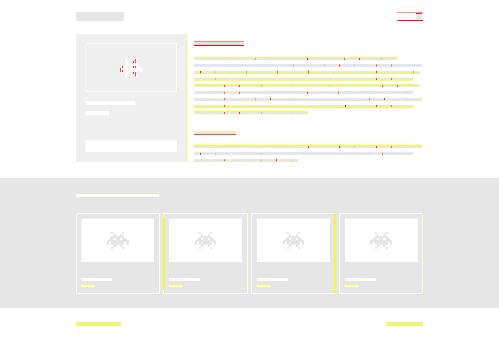

# Задание 1. Реализуйте дизайн-систему

## Комментарии к заданию

### Использованные фреймворки и библиотеки

В данном задании я использовал только [Gulp](https://gulpjs.com/) для сборки итогового css-бандла. Выбрал этот сборщик, поскольку это отличный инструмент, идеально подходящий для данной задачи. Если множество плагинов на все случаи жизни. Я использовал `gulp-concat` и `gulp-clean-css` для объединения и минификации файлов.

### Файловая структура

    src/
    ├── style.css   // Основной css-файл, куда импортируются необходимые для сборки страниц блоки
    ├── script.js
    ├── base.blocks   // Базовые блоки дизайн-системы
    |   ├── theme.layer     // Блок слоя темы
    |   ├── frame.layer     // Блоки слоя каркаса
    |   ├── pattern.layer   // Блоки слоя паттернов
    |   └── content.layer   // Блоки контентного слоя
    |
    └── content.blocks      // Контентные блоки

Весь необходимый javascript я поместил в один файл `script.js`. На блоки не разделял, потому что там не очень много кода получилось.

### Кроссбраузерность вёрстки

Проверял в последних версиях Google Chrome, Mozilla Firefox, Microsoft Edge, Opera и Safari. Везде работает.

### Неиспользованные контентные блоки

Некоторым контентным блокам, из которых собирается страница, не пришлось добавлять никаких дополнительных стилей. Страницы правильным образом собираются без них. Привожу ниже список данных блоков:

- .warning: `warning__button-wrapper`;
- .product: `product__content`, `product__footer`;
- .history: `history__destination`, `history__pic`, `history__label`, `history__time`;
- .cover: `cover__info`, `cover__footer`;
- .event: `event__content`, `event__footer`, `event__description`;

### Кнопка для переключения тем

В задании не было сказано прямым текстом, что ползунок должен ездить вправо/влево при переключении тем. Однако я реализовал именно такое поведение, поскольку оно кажется логичным.

Выглядит это так:

### Типографика

Столкнулся с проблемой, что у некоторых блоков с текстом вертикальные отступы должны быть не симметричны (сверху чуть меньше, снизу чуть больше). Я не смог докопаться до точного теоретического объяснения данного феномена, однако мне удалось выявить определенные закономерности эмпирическим путём. Я обнаружил, что данный эффект проявляется только с блоками текста, имеющими размерный модификатор `size_xl` и `size_xxl`. Причём в первом случае блок всегда съезжает вверх на `2px`, а во втором на `3px`. Соответственно, решением проблемы стало добавление дополнительных вертикальных отступов для текстовых блоков данных размеров.

### Собственные автотесты

Чтобы проконтролировать правильность выполнения задания, написал также свои автотесты. Они лежат в папке `tests`. Для их запуска требуется открыть лежащий в папке `index.html` с помощью live server (если просто открыть страницу двойным щелчком, результаты будут недоступны). Дальнейший порядок действий описан на самой странице `index.html`.

Тесты осуществляют попиксельное сравнение изображений. Для этого я использовал библиотеку [pixelmatch](https://github.com/mapbox/pixelmatch). Также я воспользовался [html2canvas](https://html2canvas.hertzen.com/) и [FileSaver.js](https://github.com/eligrey/FileSaver.js/), чтобы делать и сохранять скриншоты страниц необходимого размера.

  
Пример тестирования страницы index.html

  
Пример тестирования страницы product.html

Тесты подствечивают небольшие различия, в основном на границах блоков и на текстовых блоках. Однако это может быть связано с неидеальностью скриншотов, сделаных с помощью `html2canvas`.